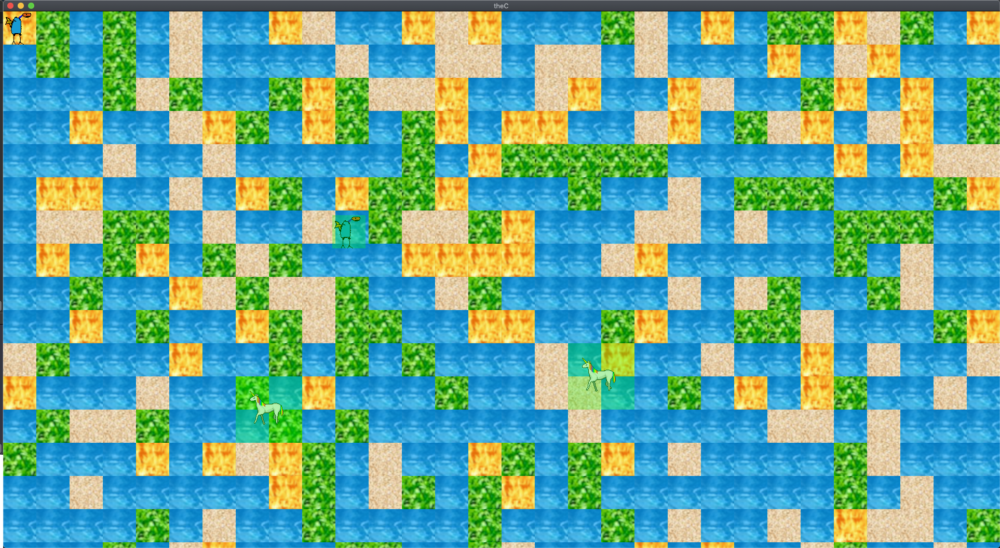

# theC
  * A beautiful game
  * you are in the sea
  * and you must win!
  * ;)

# resources

  * [json? read](https://stackoverflow.com/questions/32205981/reading-json-files-in-c)
  * [this guy is awesome](https://www.youtube.com/watch?v=ghgd-R1gRmc&list=PLHJE4y54mpC5j_x90UkuoMZOdmmL9-_rg&index=18)

  * texture packer is a nice tool for making sprite sheets
  		- give it a bunch of individual sprites and it concatenates them (exactly like my PIL python program!!)
  * tiled map editor is probably really usefull too
  	- the real problem is getting stuff to put in it !!!

# gameplay

